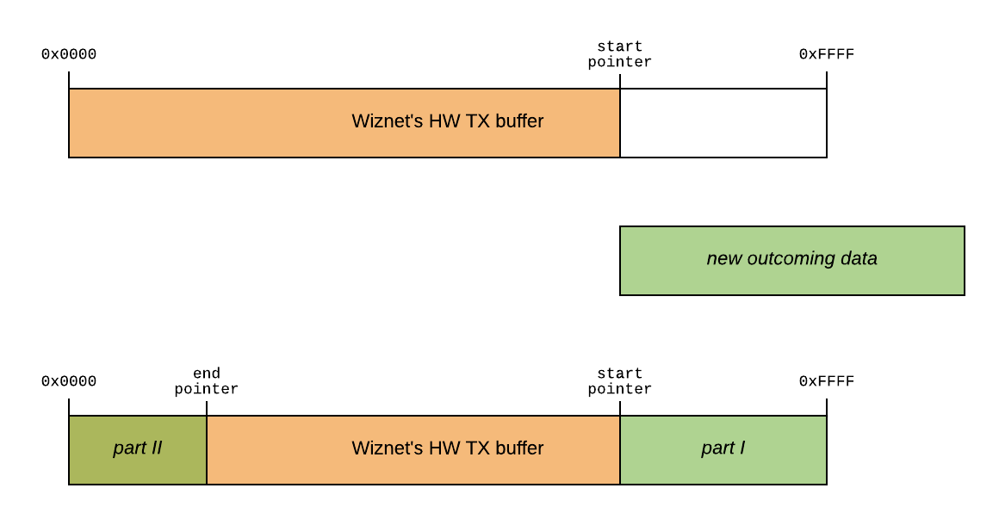

## Overview
Simple `.c/.h`-library for communicating with the Wiznet's W5500 Ethernet chip. The main goal is to make an easy-to-use API for controlling general settings and 8 hardware sockets. Official [ioLibrary](https://github.com/Wiznet/ioLibrary_Driver) may looks difficult to use, it lacks of good documentation and broad examples set so this library will try to improve in these aspects.

Architectural principles:
  - **supporting documentation and examples for every implemented feature** – comment every step and non-official hack;
  - **follow the datasheet** – 60-page paper is not very detailed but keeps pretty nice level on providing useful information and algorithms without redundancy;
  - **modularity and scalability** – you can create any number of Wiznet instances and sockets in them (of course, keep in mind HW restrictions).

Currently, the library doesn't support every feature of W5500 chip and use a pretty straight synchronous approach in data transferring processes so it can be marked as a beta-version. Also, this repository is actually a port for STM32F4 platform (tested on STM32F429ZI) and you can use it as a reference for your own port (see next chapter).


## Porting
First of all, adapt library's low level to your host' platform-specific stuff.

1. Implement these functions:
  - `_write_spi` – takes the pointer to the array of bytes (length starts from 1 byte) and transmits it via SPI in blocking mode;
  - `_read_spi` – receives SPI data in blocking mode and puts it in a given buffer array. Both read and write functions manage CS assertion by themselves. Due to the specific CS handling you should use this line as a dedicated pin in your MCU (i.e. do not use an automatic control by your MCU);
  - `_millis` – implement this to ensure a timeouts' work. On ARM, you can use a built-in SysTick timer;
  - `wiznet_hw_reset` – edit only the first part – where the RST pin is toggled.
2. Add necessary arguments as `Wiznet` structure' fields so functions above can operate independently from your main code after an initial setup.
3. Define other required specific constants, macros etc. Check default timeouts' values to be suited your desired timings.

All other functions use these abstraction layer and do not contain any HW routines. Refer to sources of this repo for help.


## Wiznet management
Prepare the periphery (i.e. initialize clocking, debug `printf()`, SPI, GPIOs (CS, RST, INT), interrupt, SysTick timer etc). Then, instantiate a `wiznet_t` structure and initialize it with default values:
```C
wiznet_t wiznet;
wiznet = wiznet_t_init();
```
To use interrupts you will need to have access to the `wiznet` variable so declare this statement in a global scope. Such structure initialization helps to avoid garbage values if user will forget to fill in some members.

Now, let's fill in public fields of our fresh new structure. For example, like this:
```C
// platform-specific
wiznet.hspi = &hspi2;
wiznet.RST_CS_Port = GPIOB;
wiznet.RST_Pin = WIZNET_RST_Pin;
wiznet.CS_Pin = WIZNET_MANUAL_CS_Pin;

// set global Wiznet network parameters
for (uint8_t i=0; i<6; i++) {
    wiznet.mac_addr[i] = (uint8_t[]){44,45,46,47,48,49}[i];
    if (i < 4) {
        wiznet.ip_addr[i] = (uint8_t[]){192,168,1,100}[i];
        wiznet.ip_gateway_addr[i] = (uint8_t[]){192,168,1,1}[i];
        wiznet.subnet_mask[i] = (uint8_t[]){255,255,255,0}[i];
    }
}
```

Now you can run `wiznet_init()` function to start communication with the IC and internally register this Wiznet (you can manage multiple Wiznets in one program – up to `NUM_OF_WIZNETS`):
```C
if (wiznet_init(&wiznet) == 0) printf("WIZNET INIT OK\n");
```

During this, RST pin is toggled and 2 flags are polled as a delay replacement. `wiznet_get_version()` function is used as a last correctness check of Wiznet's reset and initialization. It should always return `4` as it stands in the datasheet. In practice, Wiznet initialization takes approximately 3 seconds till we get fully working IC. Ethernet LEDs should start blinking if PHY setup was successful.

If you somehow decide to stop working with the Wiznet, in your program run `wiznet_deinit()` passing `wiznet_t *` pointer as an argument.

Now we can step forward to the socket creation.


## Sockets management
As it for Wiznet management, socket' life starts from the new struct and its filling. Assuming we have a UDP socket:
```C
socket_t socket1 = socket_t_init();
socket1.type = SOCK_TYPE_UDP;
for (uint8_t i=0; i<4; i++) socket1.ip[i] = (uint8_t[]){192,168,1,214}[i];
socket1.port = 1200;
socket(&wiznet, &socket1);
```

We use same pattern for all 3 types of sockets: TCP, UDP and MACRAW. Last line binds given socket to the given Wiznet, opens (and connects, for TCP) it.

Let's create 2 more sockets:
```C
socket_t socket2 = socket_t_init();
socket2.type = SOCK_TYPE_TCP;
for (uint8_t i=0; i<4; i++) socket2.ip[i] = (uint8_t[]){192,168,1,222}[i];
socket2.port = 1300;
socket(&wiznet, &socket2);

socket_t socket3 = socket_t_init();
socket3.type = SOCK_TYPE_MACRAW;
for (uint8_t i=0; i<6; i++) socket3.macraw_dst[i] = (uint8_t[]){0xFF,0xFF,0xFF,0xFF,0xFF,0xFF}[i];
sock_status_t s3_status = socket(&wiznet, &socket3);
```

`socket` constructor assigns proper HW socket according to the availability and type (e.g., MACRAW can only be opened in the Socket0). Currently, all sockets are allocated with default 2kB TX/RX buffers.

Now let's check statuses (in different ways) and try to send some data over each protocol. Then close sockets:
```C
uint8_t msg_udp[] = "data over UDP";
uint8_t msg_tcp[] = "data over TCP";
uint8_t msg_macraw[] = "data over MACRAW";

if (socket1.status == SOCK_STATUS_UDP) {
    sendto(&socket1, msg_udp, sizeof(msg_udp));
    sock_close(&socket1);
}

if (socket2.status == SOCK_STATUS_ESTABLISHED) {
    sendto(&socket2, msg_tcp, sizeof(msg_tcp));
    sock_discon(&socket2);
}

if (s3_status == SOCK_STATUS_MACRAW)
    sendto(&socket3, msg_macraw, sizeof(msg_macraw));
sock_close(&socket3);
```

For example, simple Python UDP server will show:
```
$ python3 udp_server.py
Wait for data...
14 b'data over UDP\x00'
```

Note that MACRAW mode currently can receive/transmit data only in networks with a 'point-to-point' type of topology.

You can completely remove and unregister socket using `sock_deinit()` function:
```C
sock_deinit(&socket1);
sock_deinit(&socket2);
sock_deinit(&socket3);
```

After such operation library can reuse corresponding HW sockets for other purposes.

`sendto()` function can handle overflows: if the size of transmitting data is bigger than the amount of free space in the HW buffer then the message is fragmenting onto 2 parts which are sent one by one by the recursive call with new pointer and length after the first transfer. Schematic illustration of this method:



In order to receive information, 2 functions are available: `recv()` and `recv_alloc()`. First one takes a static array and writes data from the HW RX buffer into it. So the case when the SW buffer is smaller than received data is possible. `recv_alloc()` takes only a pointer and allocates array by itself so it never overflows and always will have exact size of received data. Both functions determine and return size of received data placed in the HW RX buffer. These routines also implements algorithms similar to the picture above if detects that an end pointer is smaller than a start pointer. Let's try to receive and send a data in a loop:
```C
uint8_t *buf_alloc = NULL;
while (1) {
    uint16_t size = recv_alloc(&socket2, &buf_alloc);
    if (size > 0) sendto(&socket1, buf_alloc, size);
    HAL_Delay(1000);
}
```

or
```C
uint8_t buf[70];
uint32_t cnt = 0;
while (1) {
    int num = sprintf((char *)buf, "abcdefghijklmnopqrstuvwxyz. it's a test string, here is a counter ok: %d", cnt++);
    sendto(&socket3, buf, num+1);
}
```

or
```C
for (uint32_t i=0; i<sizeof(buf); i++) buf[i] = 0;  // clear the buffer
recv(&socket2, buf, sizeof(buf));
sendto(&socket1, buf, sizeof(buf));
```

`recv()` and `recv_alloc()` functions aren't blocking so they do not wait for data. Instead they just return '0' if there are no new bytes available in the Wiznet's HW RX buffer. You can check this return value to implement blocking or add this feature right into function' sources if needed.


## Interrupts
Wiznet W5500 has a single HW pin to deliver all kinds of interrupts – general and sockets ones. For not very complex applications you may not to use interrupts – library can work without them entirely. But if you want to, route INT pin to your MCU and enable falling edge trigger interrupt (INT is an active-low signal). Then in your ISR, call `wiznet_isr_handler()` passing corresponding `wiznet_t` instance as an argument to start handling. Wiznet interrupts' concept is a level-driven so they hold INT pin in a low state until all conditions are met and all flags are cleared. Therefore ISR should looks somehow like this (consider a STM32 platform):
```C
// your platform-specific falling-edge-triggered ISR here
void HAL_GPIO_EXTI_Callback(uint16_t GPIO_Pin) {
    if (GPIO_Pin == WIZNET_INT_Pin) {
        while (HAL_GPIO_ReadPin(GPIOB, WIZNET_INT_Pin) == 0) wiznet_isr_handler(&wiznet);
    }
}
```

Then `wiznet_isr_handler()` automatically determines a type of the interrupt (currently only sockets interrupts are supported) and you can assign custom actions to be performed:
```C
// insert your code here
switch (type) {
case SOCK_IR_CON:
    printf("ISR: CONNECTED\n");
    break;
case SOCK_IR_DISCON:
    printf("ISR: DISCONNECTED\n");
    break;
case SOCK_IR_RECV:
    printf("ISR: RECEIVED\n");
    break;
case SOCK_IR_TIMEOUT:
    printf("ISR: TIMEOUT\n");
    break;
case SOCK_IR_SEND_OK:
    printf("ISR: SEND OK\n");
    break;
}
```

Interrupts is the key feature that could allow to implement asynchronous architecture of the library in future releases.


## Known issues
You're welcome to fix these problems:
  - Only fairly separated in time processes can trigger interrupt and be cleared (such as send/receive actions divided by some delay);
  - IP/port not always can be read after socket initialization (returns zeros) though it have been completed correctly.
